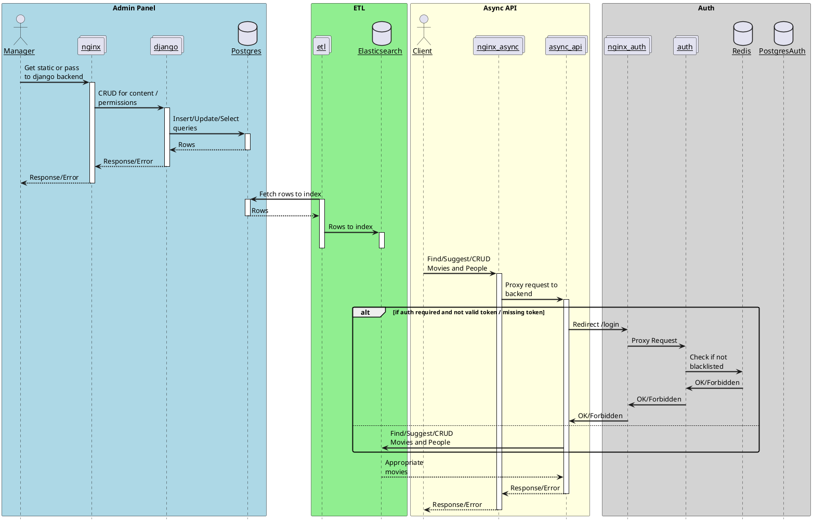

```plantuml
@startuml
skinparam componentStyle uml2
skinparam sequenceArrowThickness 2
skinparam roundcorner 5
skinparam maxmessagesize 120
skinparam sequenceParticipant underline
hide footbox
skinparam BoxPadding 2

box "Admin Panel" #LightBlue
    actor Manager
    collections nginx
    collections django
    database Postgres
end box

box "ETL" #LightGreen
    collections etl
    database Elasticsearch
end box

box "Async API" #LightYellow
    actor Client
    collections nginx_async
    collections async_api
    database Redis
end box

box "Auth" #LightGrey
    collections nginx_auth
    collections auth
    database Redis
    database PostgresAuth
    
end box

Manager -> nginx: Get static or pass to django backend
activate nginx

nginx -> django: CRUD for content / permissions
activate django

django -> Postgres: Insert/Update/Select queries
activate Postgres

Postgres --> django: Rows
deactivate Postgres

django --> nginx: Response/Error
deactivate django

nginx --> Manager: Response/Error
deactivate nginx

etl -> Postgres: Fetch rows to index
activate etl
activate Postgres

Postgres --> etl: Rows
deactivate Postgres

etl -> Elasticsearch: Rows to index
activate Elasticsearch
deactivate Elasticsearch
deactivate etl

Client -> nginx_async: Find/Suggest/CRUD Movies and People
activate nginx_async
nginx_async -> async_api: Proxy request to backend
activate async_api

alt if auth required and not valid token / missing token
    async_api -> nginx_auth: Redirect /login
    nginx_auth -> auth: Proxy Request
    auth -> Redis: Check if not blacklisted
    Redis -> auth: OK/Forbidden
    auth -> nginx_auth: OK/Forbidden
    nginx_auth -> async_api: OK/Forbidden
else
    async_api -> Elasticsearch: Find/Suggest/CRUD Movies and People
end

activate Elasticsearch
Elasticsearch --> async_api: Appropriate movies
deactivate Elasticsearch

async_api --> nginx_async: Response/Error
deactivate async_api

nginx_async --> Client: Response/Error
deactivate nginx_async
@enduml
```
